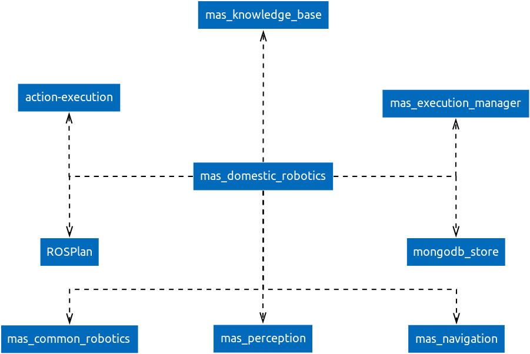

[](https://travis-ci.org/b-it-bots/mas_domestic_robotics)


# mas_domestic_robotics

## Table of contents

1. [Summary](#summary)
2. [Dependencies](#dependencies)
3. [Packages](#packages)
    1. [Planning](#planning)
    2. [Naming conventions](#naming-conventions)
4. [Getting started](#getting-started)
5. [Docker images](#docker-images)
    1. [Building the bitbots-domestic image](#building-the-bitbots-domestic-image)
    2. [Travis](#travis)
6. [License](#license)
6. [Acknowledgments](#acknowledgments)

## Summary

This repository contains various core domestic robotics functionalities developed by the Autonomous Systems group at Hochschule Bonn-Rhein-Sieg.

The code in this repository is mostly ROS-based and is developed in a robot-independent manner. Robot-dependent code and/or configuration files are hosted in robot-specific repositories, e.g. [mas_cob](https://github.com/b-it-bots/mas_cob) for our Care-O-bot.

# Dependencies

`mas_domestic_robotics` is not a standalone repository and depends on many other components. A diagram of the major dependencies is shown below:



Most of the major dependencies are also developed in-house and, in the interest of modularity, are hosted in separate repositories.

A more complete set of dependencies can be found in the [`mas-domestic.rosinstall`](mas-domestic.rosinstall) file.

## Packages

The functionalities in this repository are organised based on the main capabilities a domestic robot needs to possess. Each of these has its own ROS metapackage, which further includes a set of packages related to that particular functionality. A rough summary of the contents of these packages contents can be found below:

* `mdr_navigation` - Mapping and autonomous navigation
* `mdr_manipulation` - Grasp planner
* `mdr_hri` - Visualization, sound vocalization, graphical user interfaces
* `mdr_msgs` - ROS messages for all the mas_domestic_robotics packages
* `mdr_speech` - Speech recognition and NLP
* `mdr_perception` - Object recognition, people detection and recognition.

### Planning

The planning metapackage is where most of the high-level functionalites of our robots are implemented. We are developing our robots as skill-based agents; the planning metapackage includes *action* and *scenario* metapackages because of that. The action metapackage is further divided into metapackages for actions related to particular capabilities, while the scenario metapackage includes domain files and/or state machines for various scenarios (e.g. RoboCup@Home tasks, lab demos, and so forth). In principle, scenarios are built by integrating actions together, which is the main benefit of the skill-based agent framework.

### Naming conventions

All packages in our domestic code base start with the `mdr_` suffix; this stands for `mas_domestic_robotics`, which is the name of the top-level directory/ROS metapackage.

## Getting started

### Development setup

b-it-bots members can use [these instructions](https://github.com/b-it-bots/dev-env#setup) to setup a complete development environment for all our robots.

For external users, the following instructions should get you a working system:

1. Set up a catkin workspace

  ```
  mkdir -p ~/catkin_ws/src && cd ~/catkin_ws
  wstool init src
  wstool merge -t src https://raw.githubusercontent.com/b-it-bots/mas_domestic_robotics/devel/mas-domestic.rosinstall
  ```
  **Note:** If you want to set up a development environment, replace `mas-domestic.rosinstall` with `mas-domestic-devel.rosinstall` in the above command.

2. Get the code and dependencies

  ```
    wstool update -t src
    rosdep install --from-paths src --ignore-src --rosdistro=kinetic -y
  ```
  **Note:** If setting up on the robot, skip the `rosdep install` command.

3. Build the code

  ```
  catkin build
  ```
  Make sure that you have sourced `/opt/ros/kinetic/setup.bash` before building the packages.

If you encounter any problems, please check the list of [issues](https://github.com/b-it-bots/mas_domestic_robotics/issues) and open a new one if you don't see a discussion of the problem there.

### Tutorials

A selection of tutorials that explain various architectural decisions and describe some of the commonly used components can be found in the [mas_tutorials](https://github.com/b-it-bots/mas_tutorials) repository.

## Docker images

If you want to test locally without installing our software and its dependencies, you need to install [docker](https://docs.docker.com/install/linux/docker-ce/ubuntu/) and [docker-compose](https://docs.docker.com/compose/install/).

You can pull the image for this repository:

```
docker pull bitbots/bitbots-domestic:kinetic
```

### Building the bitbots-domestic image

To manually build this image, first cd into this repository, then execute

```
docker build -t bitbots/bitbots-domestic:kinetic .
```

### Travis

We use continuous integration to ensure the quality of our software. To check locally if your changes will pass the tests, execute

```
docker-compose build
docker-compose run travis
```

## License

This project is licensed under the GPLv3 License - see the [LICENSE.md](LICENSE.md) file for details.

## Acknowledgments

This software would be impossible without
* the many generations of b-it-bots@Home members. A list of contributors can be found [here](https://github.com/b-it-bots/mas_domestic_robotics/graphs/contributors)
* the MAS staff and professors who have provided their advice and support
