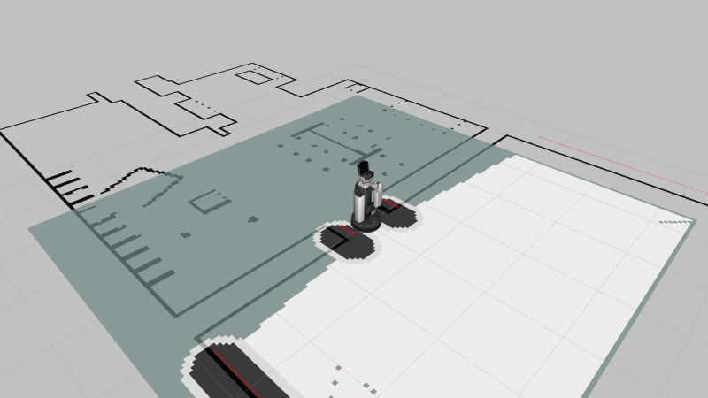

Move Arm Action
====================

To perform manipulation and in line with our skill-based domestic robot
architecture, we use a ``move_arm`` action that exposes a high-level
interface for controlling a robot arm (under the assumption that there
is a single robot arm). The ``move_arm`` action allows controlling the
arm in three different ways: 1. the arm joints can be sent to a
predefined named configuration (e.g ``folded``) using MoveIt! 2. the end
effector can be sent to a desired pose with respect to a given
coordinate frame; the arm motion can be performed either using MoveIt!
or with a dynamic motion primitive 3. the joint positions can be set
arbitrarily; once again, the motion will be performed using MoveIt!

The way in which the arm is controlled can be selected by setting the
``goal_type`` parameter of the action, such that the additional
parameters that have to be passed to the action depend on the goal type.
Please refer to the
`documentation <https://github.com/b-it-bots/mas_domestic_robotics/tree/kinetic/mdr_planning/mdr_actions/mdr_manipulation_actions/mdr_move_arm_action>`__
of the action for the action specification.

Note that the named joint configurations need to be specified in the
MoveIt! configuration file for a specific robot (for the Toyota HSR,
they are in the ``hsrb.srdf`` file in the ``hsrb_moveit_config``
package).

``move_arm`` in Action
----------------------

We can now illustrate how arm motions can be performed. Let us first
start the simulation of the Toyota HSR:

::

   roslaunch mas_hsr_sim hbrs-c069.launch

This should result in the following Rviz output:

.. code:: ipython3

    IPython.core.display.Image('images/hsr_sim_hbrs_c069.png', embed=True)

Once the simulation has started, we need to start the server for the
``move_arm`` action:

::

   roslaunch mas_hsr_move_arm_action move_arm.launch 

Let’s now set up a client for the action:

.. code:: ipython3

    import rospy
    import actionlib
    from mdr_move_arm_action.msg import MoveArmAction, MoveArmGoal
    
    # we set an arbitrary timeout for the action
    action_timeout = 15.
    
    rospy.init_node('move_arm_client_test')
    
    client = actionlib.SimpleActionClient('/move_arm_server', MoveArmAction)
    client.wait_for_server()

Let’s assume that we want to send the arm to the
:math:`(x,y,z) = (0.4, 0.078, 0.8)m` with orientation
:math:`(x,y,z) = (0, 0, 0)` with respect to the ``base_link`` frame
using MoveIt! The following code snippet (adapted from the
`move_arm_action_client_test <https://github.com/b-it-bots/mas_domestic_robotics/blob/kinetic/mdr_planning/mdr_actions/mdr_manipulation_actions/mdr_move_arm_action/ros/scripts/move_arm_action_client_test>`__
script) will do just that:

.. code:: ipython3

    from geometry_msgs.msg import PoseStamped
    
    goal = MoveArmGoal()
    goal.goal_type = MoveArmGoal.END_EFFECTOR_POSE
    
    pose = PoseStamped()
    pose.header.frame_id = 'base_link'
    
    pose.pose.position.x = 0.4
    pose.pose.position.y = 0.078 # hsr-specific arm offset
    pose.pose.position.z = 0.8
    
    pose.pose.orientation.x = 0.
    pose.pose.orientation.y = 0.
    pose.pose.orientation.z = 0.
    pose.pose.orientation.w = 1.
    
    goal.end_effector_pose = pose
    
    # empty if we want to use MoveIt! rather than a DMP for moving the arm
    goal.dmp_name = ''
    
    client.send_goal(goal)
    client.wait_for_result(rospy.Duration.from_sec(int(action_timeout)))
    
    result = client.get_result()
    if result and result.success:
        print('Arm moved successfully')
    else:
        print('Could not move the arm')

If we want to send the arm to a predefined joint configuration instead
of sending the end effector to a given pose, we can call the action as
follows:

.. code:: ipython3

    goal = MoveArmGoal()
    goal.goal_type = MoveArmGoal.NAMED_TARGET
    goal.named_target = 'go'
    
    client.send_goal(goal)
    client.wait_for_result(rospy.Duration.from_sec(int(action_timeout)))
    
    result = client.get_result()
    if result and result.success:
        print('Arm moved successfully')
    else:
        print('Could not move the arm')