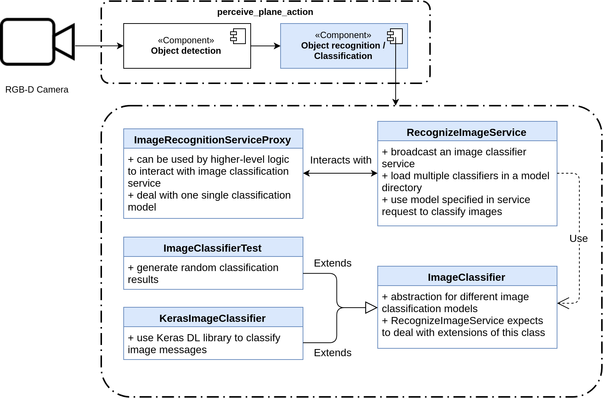
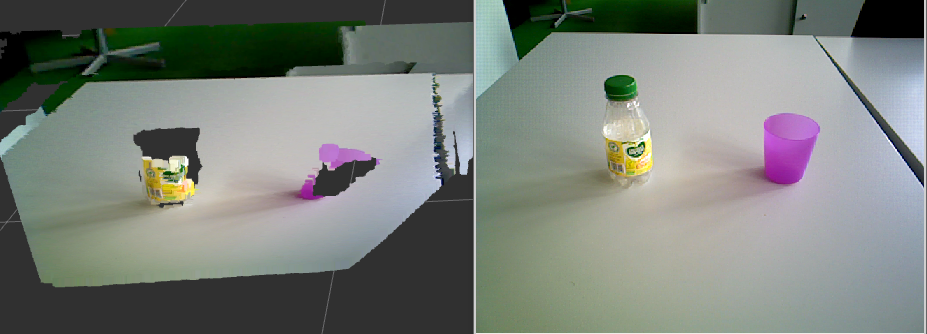

Overview
================
Architecture of perception and various utilities for processing point clouds and images existing in the
``mas_perception_libs`` package will be discussed in this section. 

Object recognition pipeline
---------------------------

Some design reasons for the above architecture are:

* Relying solely on point clouds for detection is not always reliable, especially in domestic environment, because of the variety of materials and object shapes. For example, RGB-D cameras have a particularly hard time with plastic objects, as can be seen in the figure below.
* Exciting new detection algorithms tend to deal with RGB-only images, which are often less affected by object materials. However, many of these use deep learning (DL) libraries in Python, whereas the old detection code is written in C++.
* The fast moving pace of DL demands some form of abstraction for easing integration of new algorithms.

With the above points in mind, the main features of this architecture are:

* ``ObjectDetector`` (see the [`Python documentation <https://github.com/b-it-bots/mas_perception_libs/blob/devel/docs/python_package.md#objectdetector>`__] for more details) is an abstraction which interacts with higher-level state machines and planning logic.
  - It also works with the HSR built-in `tabletop_segmentator` component (this has not been tested since mid 2018, however).
  - A similar detection action server which uses `mcr_scene_segmentation` can be implemented without much effort and would be able to interact with ``ObjectDetector``, as long as it properly handles the action defined in [`mcr_perception_msgs/DetectScene.action <https://github.com/b-it-bots/mas_perception/blob/kinetic/mcr_perception_msgs/action/DetectScene.action>`__].
* ``SceneDetectionAction`` is an abstraction for a handler of the `mcr_perception_msgs/DetectScene` action. The interaction with HSR's **tabletop_segmentator**, for example, is handled in an extension of this class. Extensions of this class are meant to have direct access to sensor topics for efficiency.
* ``ImageDetectorBase`` (see the [`Python documentation <https://github.com/b-it-bots/mas_perception_libs/blob/devel/docs/python_package.md#imagedetectorbase>`__] for more details) is an abstraction for different image detection algorithms, which would hopefully ease the integration of new algorithms in the future.

Possible improvements for the object detection architecture:

* Combining the point cloud detection and image detection for a more robust solution can be done in an extension of ``SceneDetectionAction``.
* ``mcr_perception_msgs/DetectScene`` and ``SceneDetectionAction`` can be more general; in particular, detecting objects without being attached to a plane, detecting people, as well as handling scene/semantic segmentation would all be useful additions.
* ``SingleImageDetectionHandler`` can be extended to handle multiple images (possibly a queue model).
* Currently, ``ImageDetectionActionServer`` handles cloud processing code such as plane fitting, cloud filtering, and object pose estimation. Pose estimation may need to be refactored to a different location, if more advanced methods are to be integrated.

Object Recognition
------------------

The following figure shows the architecture of the image recognition/classification component. The main features are:

* Common proxy and service for the [`ImageRecognition service <https://github.com/b-it-bots/mas_perception./blob/devel/mcr_perception_msgs/srv/ImageRecognition.srv>`__] for handling all image classification models.
* ``RecognizeImageService`` loads all classification models from a directory; the service request specifies which model to use for classification.
* ``ImageRecognitionServiceProxy`` specifies which model to use in service requests in the constructor.

Possible improvements:

* Load all models during initialization in ``RecognizeImageService`` to avoid slow classification of first service request.
* Change ``ImageRecognitionService`` to ``RecognizeImage`` for consistency with other service names (minor).
* Use an action server instead of a service for consistency with the image detection component (minor).

mas_perception_libs
---------------------

`mas_perception_libs <https://github.com/b-it-bots/mas_perception_libs/>`__ is where almost all of the above components are defined (except for ``SSDKerasObjectDetector``). Other than architectural code, the library also provides a common API for several functionalities in both C++ and Python, most notably point cloud processing.

The following code section loads in ``sensor_msgs/PointCloud2`` ROS messages from a bag file into a list. We will then experiment with one of these clouds. Because the quirky ``rosbag`` apparently stores messages in some mutated definition of the original messages, there's the need to serialize and then deserialize the message for our next steps.

While this is not particularly important to our perception functionalities, it's worthy to note that ``from_cpp`` and ``to_cpp``, which are utility functions defined in `mas_perception_libs <https://github.com/b-it-bots/mas_perception_libs/blob/devel/ros/src/mas_perception_libs/ros_message_serialization.py>`__, imitate ROS serialization of messages.
These and their sister functions in C++ are how the Python functions are able to call C++ code on all ROS messages. In addition, any custom C++ object (e.g. `BoundingBox <https://github.com/b-it-bots/mas_perception_libs/blob/devel/docs/python_package.md#boundingbox2d>`__) has to be implemented manually with `Boost-Python <https://boostorg.github.io/python/doc/html/index.html>`__ (or alternatives) to be used in Python. 

.. code-block:: python

        import rosbag
        from sensor_msgs.msg import PointCloud2
        from mas_perception_libs.utils import from_cpp, to_cpp

        cloud_bag = rosbag.Bag('data/sample_cloud.bag')
        bag_topics = cloud_bag.get_type_and_topic_info()[1]
        pointclouds = []
        for topic, msg, t in cloud_bag.read_messages():
            if topic not in bag_topics or bag_topics[topic].msg_type != 'sensor_msgs/PointCloud2':
                continue
            pointclouds.append(msg)
        cloud_bag.close()
        cloud_msg = pointclouds[0]

        print('Oh no type doesn\'t match:\t type(cloud_msg) == PointCloud2 ? ' + str(type(cloud_msg) == PointCloud2))
        print('Actual type:\t\t\t type(cloud_msg) = ' + str(type(cloud_msg)))

        # some trickery required for converting the rosbag message type to the original type
        cloud_msg = from_cpp(to_cpp(cloud_msg), PointCloud2)

        print('All is good now:\t\t type(cloud_msg) == PointCloud2 ? ' + str(type(cloud_msg) == PointCloud2))