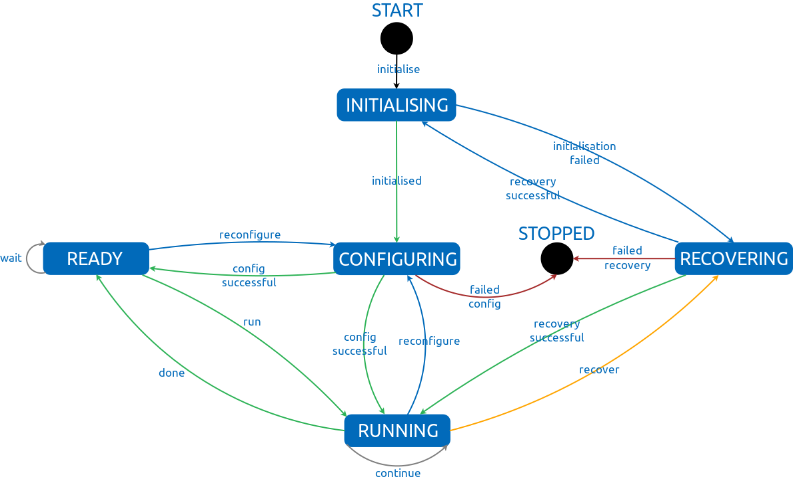
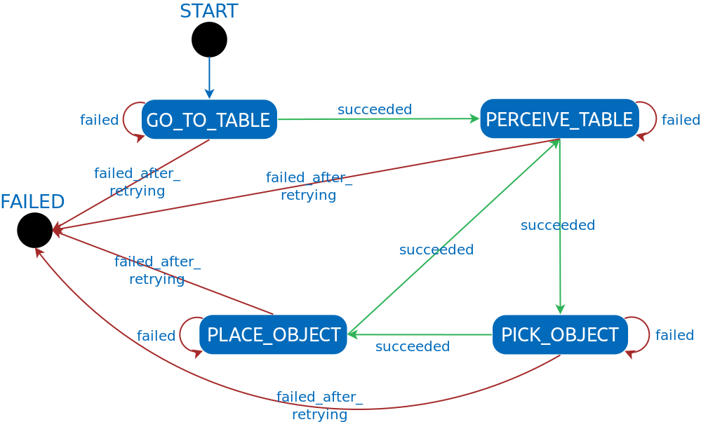

Architecture
============
The main principles behind the design of the domestic robotics software architecture 
as well as its intended use will be discussed under this section.

List of contents
----------------

1. `Domestic Software 101 <#domestic-software-101>`__
2. `Robot-Indepenent and Robot-Dependent
   Functionalities <#robot-independent-and-robot-dependent-functionalities>`__

   1. `Skill-Based Architecture <#skill-based-architecture>`__
   2. `ROS-Based and ROS-Independent
      Components <#ros-based-and-ros-independent-components>`__
   3. `Multi-Repository Setup <#multi-repository-setup>`__

3. `Major Robot-Independent
   Components <#major-robot-independent-components>`__
4. `Planning and Knowledge-Oriented
   Development <#planning-and-knowledge-oriented-development>`__
5. `Common Interfaces in
   mas_domestic_robotics <#common-interfaces-in-mas-domestic-robotics>`__
6. `Fault-Tolerant Actions <#fault-tolerant-actions>`__
7. `Skill Implementation Use Case: Move
   Base <#skill-implementation-use-case-move-base>`__

   1. `Action Execution
      Implementation <#action-ftsm-implementation>`__
   2. `Action Server <#action-server>`__
   3. `Action Client <#action-client>`__

8. `Scenario Use Case: Simple Pick and
   Place <#scenario-use-case-simple-pick-and-place>`__

   1. `Scenario Description <#scenario-description>`__
   2. `Scenario State Machine
      Definition <#scenario-state-machine-definition>`__
   3. `Example Behaviour Implementation: Move
      Base <#example-behaviour-implementation-move-base>`__

9. `About This Tutorial <#about-this-tutorial>`__
    

Domestic Software 101
---------------------

Skill-Based Architecture
~~~~~~~~~~~~~~~~~~~~~~~~

Our domestic architecture is based on the concepts of skills and
behaviours that, when combined together, allow a robot to perform
complex tasks.

We distinguish between skills and behaviours as follows: 

- **skills** are “primitive” functionalities that a robot can perform (and are thus equivalent to actions in the classical planning sense)
- **behaviours** change the context in which actions are performed and thus usually reparameterise skills in some manner

It is clearly difficult - if not impossible - to come up with a generic
level of granularity of skills and behaviours. We have attempted to make
use of what is generally done in the robotics literature, such that we
have implementations of skills such as ``move base``, ``turn base``,
``pickup``, ``place``, ``perceive plane``; on the other hand, we have
behaviours such as ``pick_closest_from_surface``,
``place_based_on_category``, although we also have generic behaviours
that exactly match the skill names (e.g. ``move_base`` or ``place``),
which have a default set of assumptions about the actions and their
context.

ROS-Based and ROS-Independent Components
~~~~~~~~~~~~~~~~~~~~~~~~~~~~~~~~~~~~~~~~

For historical purposes, **our domestic architecture is ROS-based at its
core**. Since both robots that we are currently working with - the
Care-O-bot 3 and the Toyota HSR - heavily rely on ROS, having a
ROS-based architecture simplifies the integration of our functionalities
with the already existing robot components (for instance sensor drivers
and navigation components); in addition, ROS makes it possible to
develop different components in different programming languages, which
is nice since it allows our developers to use the language they feel
most comfortable with for achieving a certain purpose.

While ROS-based architectures have various advantages, **completely
relying on ROS makes it a bit difficult to use certain best practices in
software engineering and often introduces an unnecessary overhead in how
components are used**. This has sometimes lead to difficult-to-maintain
components in our code base.

So, while we do rely on ROS as a backbone, our architecture also makes
use of various home-made ROS-indepenent components that are meant to
eliminate some of the disadvantages mentioned above. One caveat of this
is that most of our domestic software is now written in Python (since we
currently only support ROS kinetic, we still live in the past and use
Python 2).

Multi-Repository Setup
~~~~~~~~~~~~~~~~~~~~~~

Given all different aspects that need to be taken into account to make
robots useful (perception, navigation, manipulation, reasoning), robot
software tends to get quite complex in practice and managing all
different components can be fairly complicated. In order to simplify
this management process, **our architecture makes use of a
multi-repository setup with various major components being hosted in
separate repositories rather than in a monolithic repository**.

A multi-repository setup eases the treatment of different
functionalities and allows developers to focus on different aspects
without interfering with each other (too much). The downside of this is
that it becomes difficult to get a development setup up and running
since the repository dependencies need to be clearly specified. To
alleviate this problem, we make extensive use of advanced tooling; in
particular, we:

-  specify dependencies of a repository in rosinstall files and use
   ``wstool`` for acquiring them automatically
-  make use of continuous integration (in particular ``Travis``)

Robot-Independent and Robot-Dependent Functionalities
-----------------------------------------------------

Unfortunately, robots often get outdated and it sometimes becomes
necessary to replace a platform with a newer one. To make the
accommodation of new platforms as painless as possible, our architecture
distinguishes between *robot-independent* and *robot-dependent*
components:

-  **Robot-independent components occupy the core of our architecture**
   and are implemented in a way that - hopefully - makes as few
   robot-dependent assumptions as possible, which should simplify the
   process of interfacing with new robots when the need for that arises
-  **Robot-dependent components** either **inherit from the
   robot-independent components** or simply make use of the
   robot-independent components by **reparameterising them for a
   specific robot platform**.

To give an example, our robot-independent code base includes
implementations of various robot actions, such as ``pick``, ``place``,
``move base``, and so forth; these are parameterised as much as possible
(for example, ROS topic names that are likely to have different names
for different robots are made parameters) so that using them on a
different robot is mostly a matter of setting the correct values for
those parameters (although this is how everything should work in theory,
in practice we often find that implementations do indeed have various
robot-dependent assumptions, which requires rethinking of components).

Major Robot-Independent Components
----------------------------------

Our primary repository that contains the core functionalities is
`mas_domestic_robotics <https://github.com/b-it-bots/mas_domestic_robotics>`__;
that is where we have all our skills and behaviours and all the “glue”
code that combines everything together. This repository is however in
the center of a multitude of repositories that we use. A diagram
illustrating the interaction between various repositories of ours is
shown below.

.. figure:: ../../images/architecture.png
    :align: center

A brief description of these is given below:

-  `mas_common_robotics <https://github.com/b-it-bots/mas_common_robotics>`__:
   A set of generic components shared by the b-it-bots@Home and @Work
   teams.
-  `mas_perception <https://github.com/b-it-bots/mas_perception>`__:
   Contains various libraries dealing with perception-related aspects
   (mostly vision), such as object detection and recognition, point
   cloud processing, and image segmentation.
-  `mas_navigation <https://github.com/b-it-bots/mas_navigation>`__:
   This repository is used for configuring navigation-related components
   (although we don’t use these very often).
-  `mas_knowledge_base <https://github.com/b-it-bots/mas_knowledge_base>`__:
   Hosts interfaces to an ontology and an online knowledge base in the
   form of predicates and fluents that describe the world.
-  `mas_execution_manager <https://github.com/b-it-bots/mas_execution_manager>`__:
   A library for easily configuring state machines (which we use for
   specifying scenario configuration). The library also contains a base
   class interface for implementing actions in a fault-tolerant manner.
-  `action-execution <https://github.com/b-it-bots/action-execution>`__:
   The action execution library aims to centralise the process of making
   decision at execution time and includes:

   -  an ontology of actions and action failures
   -  implementations of models for executing actions (e.g. for the
      ``place`` action, one execution model samples poses on a given
      surface regardless of whether they are in free space or not and
      returns a placing candidate pose on the surface, while another one
      samples poses in free space only; for the ``pickup`` action, an
      execution model samples candidate grasping poses and returns the
      closest feasible grasping pose)

-  `ftsm <https://github.com/b-it-bots/ftsm>`__: A library exposing an
   interface to a state machine which can be used for implementing
   components in a fault-tolerant manner

Planning- and Knowledge-Oriented Development
--------------------------------------------

Our system embeds skills in a planning-oriented architecture built
around the `ROSPlan <https://github.com/b-it-bots/ROSPlan>`__ system
(even though we don’t always plan as such), where each skill is
implemented as a separate action. **The implementation of actions is
split into two components - an action server and an action client -**
where the server is the one that takes care of the actual execution
(e.g. the ``place`` server performs the necessary robot motions for
placing an object), while the client is the one that waits for requests
(coming from a plan/task dispatcher). In order to maintain an updated
state of the world, actions perform knowledge base updates after
execution.

In order to be as flexible and as intelligent as possible, we develop
our robots so that they behave in a “closed-loop” manner by using both
**encyclopedic and online knowledge about the world**. The
functionalities for knowledge management are centralised in the
``mas_knowledge_base`` repository, which exposes interfaces for querying
the knowledge base and updating its state. This repository also contains
an interface for interacting with OWL ontologies, since we use an OWL
ontology (also included there) for encoding encyclopedic knowledge about
the world.

A diagram illustrating the interactions between components that occur
during execution is shown below.

.. figure:: ../../images/planning_flowchart.png
    :align: center

Common Interfaces in mas_domestic_robotics
------------------------------------------

To simplify the implementation of robot-dependent functionalities, the
``mas_domestic_robotics`` repository defines various robot-independent
interfaces that can then be implemented for a specific robot. For
instance, the ``mdr_sound_vocalisation`` package defines the following
base class (defined
`here <https://github.com/b-it-bots/mas_domestic_robotics/blob/devel/mdr_hri/mdr_sound_vocalisation/ros/src/mdr_sound_vocalisation/sound_vocaliser_base.py>`__)
for implementing functionalities related to making robot sounds:

..  code-block:: python3

    import rospy
    from std_msgs.msg import String

    class SoundVocaliserBase(object):
        def __init__(self):
            self.speech_request_topic = rospy.get_param('~speech_request_topic', '/say')
            self.sound_request_topic = rospy.get_param('~sound_request_topic', '/make_sound')
            self.speech_topic = rospy.get_param('~speech_topic', '/sound/say')
            self.sound_topic = rospy.get_param('~sound_topic', '/sound/make')

            self.speech_request_sub = rospy.Subscriber(self.speech_request_topic,
                                                    String,
                                                    self.say)
            self.sound_request_sub = rospy.Subscriber(self.sound_request_topic,
                                                    String,
                                                    self.make_sound)

        def say(self, msg):
            rospy.loginfo('[SAY] Ignoring request')

        def make_sound(self, msg):
            rospy.loginfo('[MAKE_SOUND] Ignoring request')

A similar interface is provided by the ``mdr_gripper_controller``
package, which defines an interface to an end-effector of a robot
manipulator (the definition is
`here <https://github.com/b-it-bots/mas_domestic_robotics/blob/devel/mdr_manipulation/mdr_gripper_controller/ros/src/mdr_gripper_controller/gripper_controller_base.py>`__):

..  code-block:: python3

    import rospy

    class GripperControllerBase(object):
        def open(self):
            rospy.loginfo('[OPEN_GRIPPER] Ignoring request')
            raise NotImplementedError()

        def close(self):
            rospy.loginfo('[CLOSE_GRIPPER] Ignoring request')
            raise NotImplementedError()

        def init_grasp_verification(self):
            rospy.loginfo('[INIT_GRASP_VERIFICATION] Ignoring request')
            raise NotImplementedError()

        def verify_grasp(self):
            rospy.loginfo('[VERIFY_GRASP] Ignoring request')
            raise NotImplementedError()

Another good example is an interface for implementing action clients
(namely components that wait for action requests, execute an action, and
update the knowledge base after the execution), which is implemented in
the ``mdr_rosplan_interface`` package (in particular
`here <https://github.com/b-it-bots/mas_domestic_robotics/blob/devel/mdr_planning/mdr_rosplan_interface/ros/src/mdr_rosplan_interface/action_client_base.py>`__):

..  code-block:: python3

    import abc

    import rospy
    import rosplan_dispatch_msgs.msg as plan_dispatch_msgs
    import diagnostic_msgs.msg as diag_msgs
    from mas_knowledge_base.domestic_kb_interface import DomesticKBInterface

    class ActionClientBase(object):
        def __init__(self):
            self.action_success_msg = 'action achieved'
            self.action_failure_msg = 'action failed'

            # unique action ID
            self.action_id = -1

            # name of the robot on which the client is spawned
            self.robot_name = None

            # name of the action (converted to lowercase)
            self.action_name = rospy.get_param('~action_name', '')
            self.action_name = self.action_name.lower()

            # name of the action server
            self.action_server_name = rospy.get_param('~server_name', '')

            # timeout for action calls
            self.action_timeout = rospy.get_param('~action_timeout', 15.)

            # knowledge base interface instance
            self.kb_interface = DomesticKBInterface()

            # subscriber for dispatched actions
            rospy.Subscriber('action_dispatch_topic',
                            plan_dispatch_msgs.ActionDispatch,
                            self.call_action)

            # action feedback publisher
            self.feedback_pub = rospy.Publisher('action_feedback_topic',
                                                plan_dispatch_msgs.ActionFeedback,
                                                queue_size=1)

        @abc.abstractmethod
        def call_action(self, msg):
            '''Abstract callback for the dispatched action subscriber.
            Only reacts to request to "self.action_name"; ignores all other requests.

            Keyword arguments:
            msg -- a rosplan_dispatch_msgs.msg.ActionDispatch instance

            '''
            pass

        @abc.abstractmethod
        def get_action_message(self, rosplan_action_msg):
            '''Abstract method for converting the message to an action request.
            Returns an actionlib goal instance for the action.

            Keyword arguments:
            rosplan_action_msg -- a rosplan_dispatch_msgs.msg.ActionDispatch instance

            '''
            return None

        @abc.abstractmethod
        def update_knowledge_base(self):
            '''Abstract method for updating the knowledge base after
            the successful completion of an action.
            '''
            pass

        def send_action_feedback(self, success):
            '''Publishes a rosplan_dispatch_msgs.msg.ActionFeedback message
            based on the result of the action execution.

            Keyword arguments:
            success -- a Boolean indicating whether the action was successfully executed

            '''
            msg = plan_dispatch_msgs.ActionFeedback()
            msg.action_id = self.action_id
            if success:
                msg.status = self.action_success_msg
            else:
                msg.status = self.action_failure_msg

            action_name_kvp = diag_msgs.KeyValue()
            action_name_kvp.key = 'action_name'
            action_name_kvp.value = self.action_name
            msg.information.append(action_name_kvp)

            self.feedback_pub.publish(msg)

The above interfaces illustrate a general pattern that we want to follow
in our architecture, namely we want to **create abstractions** of
functionalities that can then be extended for a very particular purpose.
This is simply a good software engineering practice that we try to
follow in our architecture.

Fault-Tolerant Actions
----------------------

Robots are unfortunately very error-prone, so this aspect has to be
taken into account in the development of robot functionalities. As
mentioned above, the ``mas_execution_manager`` repositories includes an
interface for implementing actions in a fault-tolerant manner, which is
shown below for convenience (the definition of the interface is
`here <https://github.com/b-it-bots/mas_execution_manager/blob/master/common/mas_execution/action_sm_base.py>`__):

..  code-block:: python3

    from abc import abstractmethod
    from pyftsm.ftsm import FTSM, FTSMTransitions

    class ActionSMBase(FTSM):
        def __init__(self, name, dependencies, max_recovery_attempts=1):
            super(ActionSMBase, self).__init__(name, dependencies, max_recovery_attempts)
            self.execution_requested = False
            self.goal = None
            self.result = None

        def init(self):
            return FTSMTransitions.INITIALISED

        def configuring(self):
            return FTSMTransitions.DONE_CONFIGURING

        def ready(self):
            if self.execution_requested:
                self.result = None
                self.execution_requested = False
                return FTSMTransitions.RUN
            else:
                if self.result:
                    self.result = None
                return FTSMTransitions.WAIT

        def running(self):
            return FTSMTransitions.DONE

        def recovering(self):
            return FTSMTransitions.DONE_RECOVERING

        @abstractmethod
        def set_result(self, success):
            pass

This interface defines a so-called fault-tolerant state machine (FTSM),
which is illustrated in the diagram below:

This component is a very recent addition to our set of libraries, such
that almost all our actions are implemented by reusing this abstraction.
There is clearly a connection between the fault-tolerant implementation
of actions and the ontology in the ``action-execution`` library (but the
integration of the two is ongoing work).

Skill Implementation Use Case: Move Base
----------------------------------------

Implementing skills in our domestic code base is always a three-step
process:

1. **The action needs to be implemented as a component inheriting from
   the ``ActionSMBase`` class described above**. Not all states of the
   state machine have to be overriden, but it usually makes sense to
   override ``init`` for initialising the action (e.g. by waiting for
   its dependencies to become available), ``running`` for actually
   performing the action, and ``recovering`` for specifying what needs
   to happen if the action fails.
2. **An actionlib server for exposing the action needs to be defined**
3. **An action client inheriting from the ``ActionClientBase`` shown
   above needs to be exposed**. The action client

   1. calls the action through the above actionlib server and
   2. updates the knowledge base after the execution is complete

This process is exemplified below for the ``move_base`` action, which is
defined
`here <https://github.com/b-it-bots/mas_domestic_robotics/tree/devel/mdr_planning/mdr_actions/mdr_navigation_actions/mdr_move_base_action>`__.

Action FTSM Implementation
~~~~~~~~~~~~~~~~~~~~~~~~~~

Our ``move_base`` action assumes that a robot with a manipulator is
used, such that the manipulator is brought to a safe position before the
robot starts moving. In the ``init`` method of the state machine, we
thus wait for the server of the ``move_arm`` action to become available.

The ``running`` method of the state machine is where the logic behind
executing the action is implemented. In our case, we can move to either
a named target (named targets are expected to be defined in a YAML file
such as `this
one <https://github.com/b-it-bots/mas_common_robotics/blob/kinetic/mcr_environments/mcr_default_env_config/brsu-c069/navigation_goals.yaml>`__)
or an explicitly specified pose. Either way, the arm is moved to a safe
configuration before the robot starts moving.

The complete implementation of the action FTSM is included below for
convenience.

..  code-block:: python3

    import yaml
    import rospy
    import actionlib
    import tf
    from geometry_msgs.msg import PoseStamped, Quaternion
    import move_base_msgs.msg as move_base_msgs

    from pyftsm.ftsm import FTSMTransitions
    from mas_execution.action_sm_base import ActionSMBase
    from mdr_move_arm_action.msg import MoveArmAction, MoveArmGoal
    from mdr_move_base_action.msg import MoveBaseGoal, MoveBaseFeedback, MoveBaseResult

    class MoveBaseSM(ActionSMBase):
        def __init__(self, timeout=120.,
                    safe_arm_joint_config='folded',
                    move_arm_server='move_arm_server',
                    move_base_server='/move_base',
                    pose_description_file='',
                    pose_frame='map',
                    max_recovery_attempts=1):
            super(MoveBaseSM, self).__init__('MoveBase', [], max_recovery_attempts)
            self.pose = None
            self.safe_arm_joint_config = safe_arm_joint_config
            self.move_arm_server = move_arm_server
            self.move_base_server = move_base_server
            self.pose_description_file = pose_description_file
            self.pose_frame = pose_frame
            self.timeout = timeout
            self.move_arm_client = None

        def init(self):
            try:
                self.move_arm_client = actionlib.SimpleActionClient(self.move_arm_server, MoveArmAction)
                rospy.loginfo('[move_base] Waiting for %s server', self.move_arm_server)
                self.move_arm_client.wait_for_server()
            except:
                rospy.logerr('[move_base] %s server does not seem to respond', self.move_arm_server)
            return FTSMTransitions.INITIALISED

        def running(self):
            rospy.loginfo('[move_base] Moving the arm to a safe configuration...')
            move_arm_goal = MoveArmGoal()
            move_arm_goal.goal_type = MoveArmGoal.NAMED_TARGET
            move_arm_goal.named_target = self.safe_arm_joint_config
            self.move_arm_client.send_goal(move_arm_goal)
            self.move_arm_client.wait_for_result()

            pose = PoseStamped()
            if self.goal.goal_type == MoveBaseGoal.NAMED_TARGET:
                destination = self.goal.destination_location
                rospy.loginfo('[move_base] Moving base to %s', destination)

                self.pose = self.convert_pose_name_to_coordinates(destination)
                pose.header.stamp = rospy.Time.now()
                pose.header.frame_id = self.pose_frame
                pose.pose.position.x = self.pose[0]
                pose.pose.position.y = self.pose[1]

                quat = tf.transformations.quaternion_from_euler(0, 0, self.pose[2])
                pose.pose.orientation = Quaternion(*quat)
            elif self.goal.goal_type == MoveBaseGoal.POSE:
                pose = self.goal.pose
                rospy.loginfo('[move_base] Moving base to %s', pose)
            else:
                rospy.logerr('[move_base] Received an unknown goal type; ignoring request')
                self.result = self.set_result(False)
                return FTSMTransitions.DONE

            goal = move_base_msgs.MoveBaseGoal()
            goal.target_pose = pose

            move_base_client = actionlib.SimpleActionClient(self.move_base_server,
                                                            move_base_msgs.MoveBaseAction)
            move_base_client.wait_for_server()
            move_base_client.send_goal(goal)
            success = move_base_client.wait_for_result()

            if success:
                rospy.loginfo('[move_base] Pose reached successfully')
                self.result = self.set_result(True)
                return FTSMTransitions.DONE

            rospy.logerr('[move_base] Pose could not be reached')
            self.result = self.set_result(False)
            return FTSMTransitions.DONE

        def convert_pose_name_to_coordinates(self, pose_name):
            stream = open(self.pose_description_file, 'r')
            poses = yaml.load(stream)
            stream.close()
            try:
                coordinates = poses[pose_name]
                return coordinates
            except:
                rospy.logerr('Pose name "%s" does not exist' % (pose_name))
                return None

        def set_result(self, success):
            result = MoveBaseResult()
            result.success = success
            return result

Action Server
~~~~~~~~~~~~~

The ``move_base`` action server, which is shown below, simply reads the
necessary parameters for the action and then waits for action requests.
This action server implementation is in fact a template that all our
action server are following.

..  code-block:: python3

    import rospy
    import actionlib

    from mdr_move_base_action.msg import MoveBaseAction
    from mdr_move_base_action.action_states import MoveBaseSM

    class MoveBaseServer(object):
        '''A server exposing a go to action.
        The server expects the following parameters to be made available on the ROS parameter server:
        * move_base_server: Name of the default move_base server (default: '/move_base')
        * pose_description_file: Name of a yaml file in which named goals are mapped
                                to actual coordinates
        * pose_frame: Name of the frame in which the poses in pose_description_file
                    are given (default: 'map')
        * safe_arm_joint_config: Name of a configuration specified in which the robot can
                                safely move around the environment (default: 'folded')
        * move_arm_server: Name of the move_arm action server (default: 'move_arm_server')
        @author Alex Mitrevski
        @contact aleksandar.mitrevski@h-brs.de
        '''
        def __init__(self):
            safe_arm_joint_config = rospy.get_param('~safe_arm_joint_config', 'folded')
            move_arm_server = rospy.get_param('~move_arm_server', 'move_arm_server')
            move_base_server = rospy.get_param('~move_base_server', '')
            pose_description_file = rospy.get_param('~pose_description_file', '')
            pose_frame = rospy.get_param('~pose_frame', '')

            rospy.loginfo('[move_base] Initialising state machine')
            self.action_sm = MoveBaseSM(safe_arm_joint_config=safe_arm_joint_config,
                                        move_arm_server=move_arm_server,
                                        move_base_server=move_base_server,
                                        pose_description_file=pose_description_file,
                                        pose_frame=pose_frame)
            rospy.loginfo('[move_base] State machine initialised')

            self.action_server = actionlib.SimpleActionServer('move_base_server',
                                                            MoveBaseAction,
                                                            self.execute, False)
            self.action_server.start()
            rospy.loginfo('move_base action server ready')

        def execute(self, goal):
            rospy.loginfo('[move_base] Received an action request')
            self.action_sm.goal = goal
            self.action_sm.result = None
            self.action_sm.execution_requested = True
            while not self.action_sm.result:
                rospy.sleep(0.05)
            self.action_server.set_succeeded(self.action_sm.result)

    if __name__ == '__main__':
        rospy.init_node('move_base_server')
        move_base_server = MoveBaseServer()
        try:
            move_base_server.action_sm.run()
            while move_base_server.action_sm.is_running and not rospy.is_shutdown():
                rospy.spin()
        except (KeyboardInterrupt, SystemExit):
            print('{0} interrupted; exiting...'.format(move_base_server.action_sm.name))
            move_base_server.action_sm.stop()

Action Client
~~~~~~~~~~~~~

Finally, the ``move_base`` action client simply waits for action
requests from a plan/task dispatcher, calls the action server, and, if
the action completes successfully, updates the knowledge base with the
fact that the robot is now at its destination location rather than at
its original location. The implementation of the ``move_base`` action
client is given below.

..  code-block:: python3

    import rospy
    import actionlib

    from mdr_rosplan_interface.action_client_base import ActionClientBase
    from mdr_move_base_action.msg import MoveBaseAction, MoveBaseGoal

    class MoveBaseClient(ActionClientBase):
        def __init__(self):
            super(MoveBaseClient, self).__init__()
            self.original_location = ''

            while not rospy.is_shutdown():
                rospy.sleep(0.1)

        def call_action(self, msg):
            # we only react to calls to this action
            if self.action_name != msg.name.lower():
                return

            self.action_id = msg.action_id

            client = actionlib.SimpleActionClient(self.action_server_name, MoveBaseAction)
            client.wait_for_server()
            goal = self.get_action_message(msg)

            # calling the actionlib server and waiting for the execution to end
            rospy.loginfo('Sending action lib goal to move_base_server,' +
                        ' destination: ' + goal.destination_location)
            client.send_goal(goal)
            client.wait_for_result(rospy.Duration.from_sec(int(self.action_timeout)))
            result = client.get_result()

            if result and result.success:
                rospy.loginfo('[MOVE_BASE] Updating the knowledge base')
                self.update_knowledge_base(goal.destination_location)
                self.send_action_feedback(True)
            else:
                self.send_action_feedback(False)

        def get_action_message(self, rosplan_action_msg):
            '''Reads the action parameters and uses them to initialise an actionlib message.
            '''
            goal = MoveBaseGoal()
            for param in rosplan_action_msg.parameters:
                if param.key == 'from':
                    self.original_location = param.value
                elif param.key == 'to':
                    goal.destination_location = param.value
                elif param.key == 'bot':
                    self.robot_name = param.value
            goal.goal_type = MoveBaseGoal.NAMED_TARGET
            return goal

        def update_knowledge_base(self, destination_location):
            '''Updates the knowledge base with the following facts:
            * the robot is not at the original location anymore
            * the robot is at the destination location
            '''
            facts_to_add = [('robot_at', [('bot', self.robot_name), ('wp', destination_location)])]
            facts_to_remove = [('robot_at', [('bot', self.robot_name), ('wp', self.original_location)])]
            self.kb_interface.update_kb(facts_to_add, facts_to_remove)

    if __name__ == '__main__':
        rospy.init_node('mdr_move_base_client')
        try:
            MoveBaseClient()
        except rospy.ROSInterruptException:
            pass

Scenario Use Case: Simple Pick and Place
----------------------------------------

One interesting aspect about our architecture is the creation of a
complex scenario that a robot can execute. Most of the time, we define
scenarios using state machines, such that we use the components in
``mas_execution_manager`` for defining and executing state machines. A
description of ``mas_execution_manager`` is beyond the scope of this
tutorial; please read the `package
documentation <https://github.com/b-it-bots/mas_execution_manager>`__
for that.

Scenario Description
~~~~~~~~~~~~~~~~~~~~

Instead, let’s consider an example to illustrate how we could define a
state machine for a scenario in which we want a robot to perform a very
simple perpetual pick-and-place functionality (this is one of our lab
demos defined
`here <https://github.com/b-it-bots/mas_domestic_robotics/tree/devel/mdr_planning/mdr_scenarios/mdr_demos/mdr_demo_simple_pick_and_place>`__).
In particular, let’s assume that we want the robot to:

1. go to a table in the lab
2. scan the table for any objects
3. pick the closest object from the table
4. place the object back on the table
5. repeat 2-4 until the execution is manually terminated

We also want to have some recovery in the execution; in particular, we
want the robot to repeat the execution if it detects a failure in each
of the states, such that if we have consecutive failures in a given
state for a predefined number of times, the state machine will be
interrupted.

Scenario State Machine Definition
~~~~~~~~~~~~~~~~~~~~~~~~~~~~~~~~~

We can encode this scenario using the YAML-based state machine
specification described in ``mas_execution_manager`` as follows:

.. code:: yaml

   sm_id: mdr_demo_simple_pick_and_place
   states: [GO_TO_TABLE, PERCEIVE_TABLE, PICK_OBJECT, PLACE_OBJECT]
   outcomes: [FAILED]
   state_descriptions:
       - state:
           name: GO_TO_TABLE
           state_module_name: mdr_navigation_behaviours.move_base
           state_class_name: MoveBase
           transitions:
               - transition:
                   name: succeeded
                   state: PERCEIVE_TABLE
               - transition:
                   name: failed
                   state: GO_TO_TABLE
               - transition:
                   name: failed_after_retrying
                   state: FAILED
           arguments:
               - argument:
                   name: destination_locations
                   value: [TABLE]
               - argument:
                   name: number_of_retries
                   value: 3
       - state:
           name: PERCEIVE_TABLE
           state_module_name: mdr_perception_behaviours.perceive_planes
           state_class_name: PerceivePlanes
           transitions:
               - transition:
                   name: succeeded
                   state: PICK_OBJECT
               - transition:
                   name: failed
                   state: PERCEIVE_TABLE
               - transition:
                   name: failed_after_retrying
                   state: FAILED
           arguments:
               - argument:
                   name: number_of_retries
                   value: 3
               - argument:
                   name: plane_prefix
                   value: table
       - state:
           name: PICK_OBJECT
           state_module_name: mdr_manipulation_behaviours.pick_closest_from_surface
           state_class_name: PickClosestFromSurface
           transitions:
               - transition:
                   name: succeeded
                   state: PLACE_OBJECT
               - transition:
                   name: failed
                   state: PICK_OBJECT
               - transition:
                   name: failed_after_retrying
                   state: FAILED
               - transition:
                   name: find_objects_before_picking
                   state: PERCEIVE_TABLE
           arguments:
               - argument:
                   name: number_of_retries
                   value: 3
               - argument:
                   name: picking_surface_prefix
                   value: table
       - state:
           name: PLACE_OBJECT
           state_module_name: mdr_manipulation_behaviours.place
           state_class_name: Place
           transitions:
               - transition:
                   name: succeeded
                   state: PERCEIVE_TABLE
               - transition:
                   name: failed
                   state: PLACE_OBJECT
               - transition:
                   name: failed_after_retrying
                   state: FAILED
           arguments:
               - argument:
                   name: number_of_retries
                   value: 3
               - argument:
                   name: placing_surface_prefix
                   value: table

The resulting state machine from this scenario definition is shown below:

In the state machine definition file, the ``state_module_name`` and
``state_class_name`` specify the package and class name that define the
state that will be executed (states are thus dynamically loaded from the
configuration file rather than hard-coded in a scenario script). In this
particular case, all states are reused from the ``mdr_behaviours``
metapackage, but they could also be redefined for a specific scenario to
capture any particular nuances about the scenario.

Example Behaviour Implementation: Move Base
~~~~~~~~~~~~~~~~~~~~~~~~~~~~~~~~~~~~~~~~~~~

Behaviours are implemented as smach states that inherit from a
``ScenarioStateBase`` class defined in ``mas_execution_manager``. To
interact with the skills, the behaviours use the action clients
described above, i.e. skills are not invoked by creating an actionlib
action client, but by sending a message to the action client much like a
plan dispatcher (though there is nothing preventing one from creating an
explicit client instead).

An example implementation of the ``move_base`` behaviour used in the
above ``GO_TO_TABLE`` state that illustrates this principle is shown
below (this behaviour can be found
`here <https://github.com/b-it-bots/mas_domestic_robotics/blob/devel/mdr_planning/mdr_behaviours/mdr_navigation_behaviours/ros/src/mdr_navigation_behaviours/move_base.py>`__):

.. code:: python3

    import time
    import rospy
    import actionlib

    import rosplan_dispatch_msgs.msg as plan_dispatch_msgs
    import diagnostic_msgs.msg as diag_msgs

    from mdr_move_base_action.msg import MoveBaseAction
    from mas_execution_manager.scenario_state_base import ScenarioStateBase

    class MoveBase(ScenarioStateBase):
        def __init__(self, save_sm_state=False, **kwargs):
            ScenarioStateBase.__init__(self, 'move_base',
                                    save_sm_state=save_sm_state,
                                    outcomes=['succeeded', 'failed', 'failed_after_retrying'])
            self.sm_id = kwargs.get('sm_id', '')
            self.state_name = kwargs.get('state_name', 'move_base')
            self.move_base_server = kwargs.get('move_base_server', 'move_base_server')
            self.destination_locations = list(kwargs.get('destination_locations', list()))
            self.timeout = kwargs.get('timeout', 120.)

            self.number_of_retries = kwargs.get('number_of_retries', 0)
            self.retry_count = 0

        def execute(self, userdata):
            original_location = self.kb_interface.get_robot_location(self.robot_name)
            for destination_location in self.destination_locations:
                dispatch_msg = self.get_dispatch_msg(original_location,
                                                    destination_location)

                rospy.loginfo('Sending the base to %s' % destination_location)
                self.say('Going to ' + destination_location)
                self.action_dispatch_pub.publish(dispatch_msg)

                self.executing = True
                self.succeeded = False
                start_time = time.time()
                duration = 0.
                while self.executing and duration < self.timeout:
                    rospy.sleep(0.1)
                    duration = time.time() - start_time

                if self.succeeded:
                    rospy.loginfo('Successfully reached %s' % destination_location)
                    original_location = destination_location
                else:
                    rospy.logerr('Could not reach %s' % destination_location)
                    self.say('Could not reach ' + destination_location)
                    if self.retry_count == self.number_of_retries:
                        self.say('Aborting operation')
                        return 'failed_after_retrying'
                    self.retry_count += 1
                    return 'failed'
            return 'succeeded'

        def get_dispatch_msg(self, original_location, destination_location):
            dispatch_msg = plan_dispatch_msgs.ActionDispatch()
            dispatch_msg.name = self.action_name

            arg_msg = diag_msgs.KeyValue()
            arg_msg.key = 'bot'
            arg_msg.value = self.robot_name
            dispatch_msg.parameters.append(arg_msg)

            arg_msg = diag_msgs.KeyValue()
            arg_msg.key = 'from'
            arg_msg.value = original_location
            dispatch_msg.parameters.append(arg_msg)

            arg_msg = diag_msgs.KeyValue()
            arg_msg.key = 'to'
            arg_msg.value = destination_location
            dispatch_msg.parameters.append(arg_msg)

            return dispatch_msg