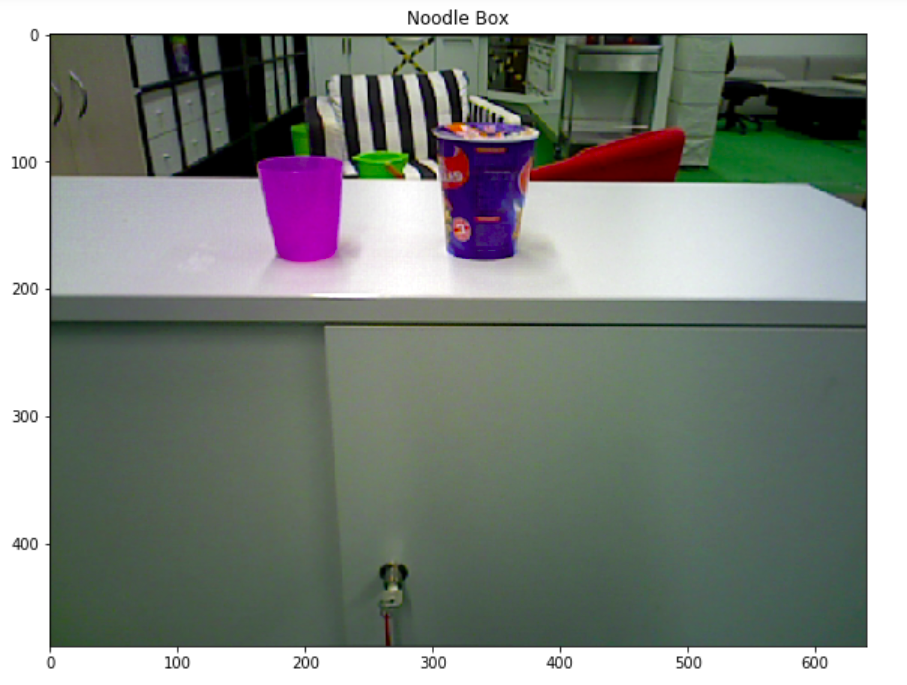
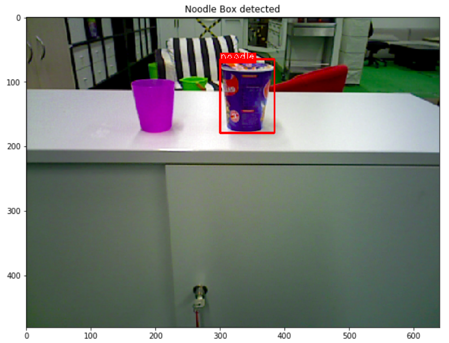
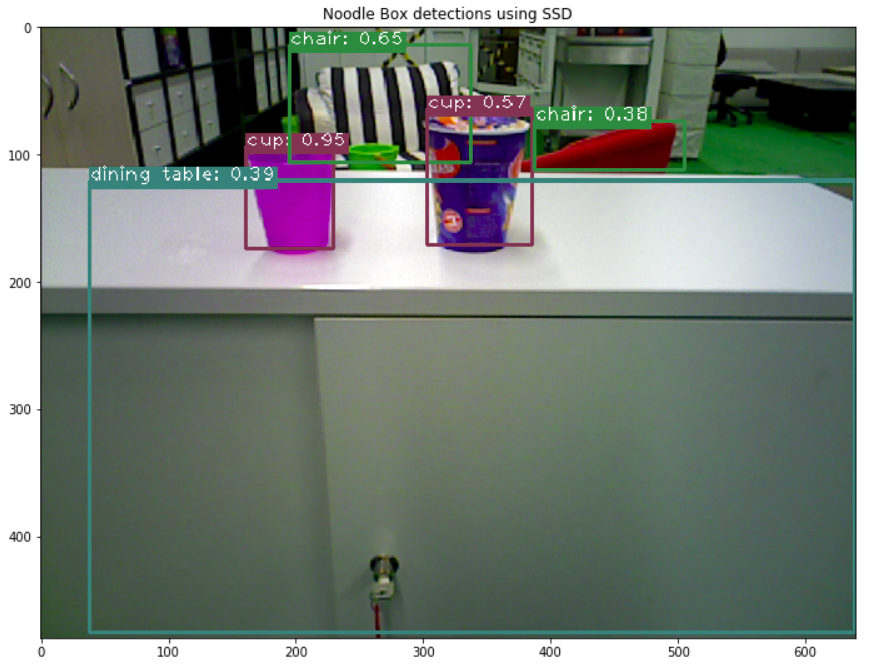
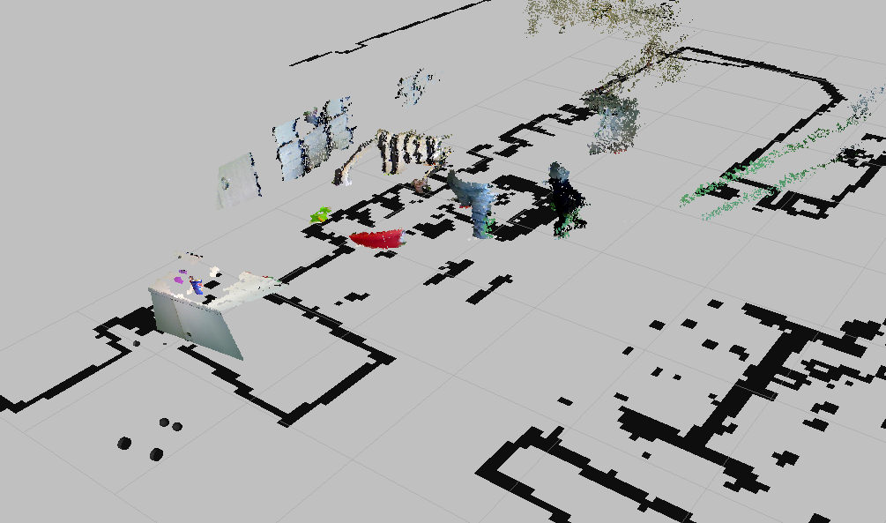
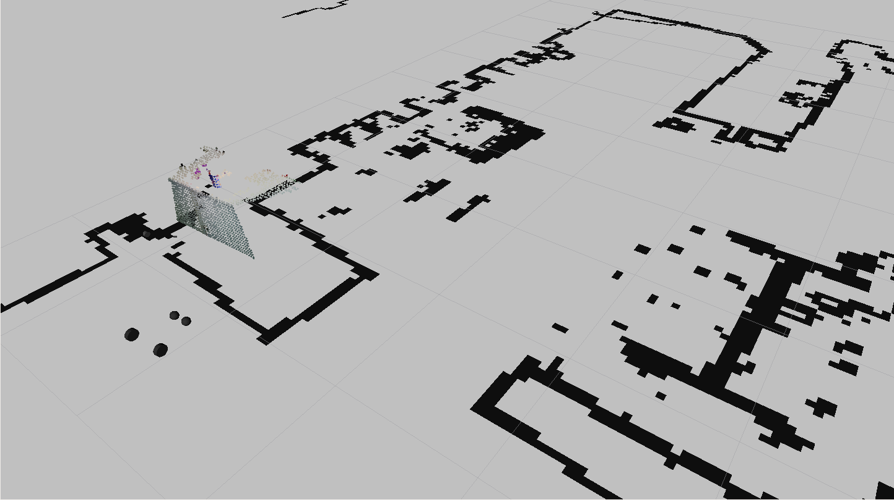
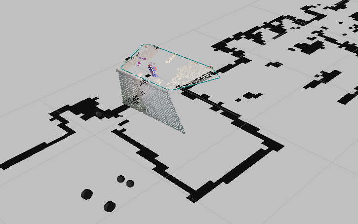
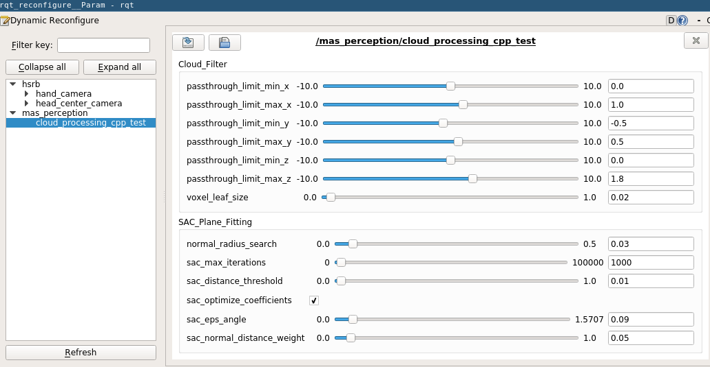

Object Detection and Pose Estimation
=====================================

Extracting an OpenCV Image from a ``sensor_msgs/PointCloud2`` Object
~~~~~~~~~~~~~~~~~~~~~~~~~~~~~~~~~~~~~~~~~~~~~~~~~~~~~~~~~~~~~~~~~~~~~

The following code illustrates how to use ``cloud_msg_to_cv_image`` to
extract an image in the form of a NumPy array from a
``sensor_msgs/PointCloud2``.

.. code:: ipython3

    %matplotlib inline
    from matplotlib import pyplot as plt
    import cv2
    from mas_perception_libs.utils import cloud_msg_to_cv_image
    
    def display_image(img, fig_width, title):
        fig_width = float(fig_width)
        height, width, _ = img.shape
        fig = plt.figure(figsize=(fig_width, fig_width / width * height))
        plt.imshow(img)
        plt.title(title)
        plt.show()
    
    cv_image = cloud_msg_to_cv_image(cloud_msg)
    print('Image shape: {0}, {1}'.format(cv_image.shape, type(cv_image)))
    
    # OpenCV has BGR instead of the RGB encoding that matplotlib expects
    cv_image = cv2.cvtColor(cv_image, cv2.COLOR_BGR2RGB)
    display_image(cv_image, 10, 'Noodle Box')

.. parsed-literal::

    Image shape: (480, 640, 3), <type 'numpy.ndarray'>

Pose Estimation
~~~~~~~~~~~~~~~

Here, we try to fit a pose to the noodle box using a very educated guess
of where it is in the image. In other words, what we are doing here
would, in practice, follow object detection and recognition.

First, we create the detection region using the ``BoundingBox2D`` class
which `is defined in
C++ <https://github.com/b-it-bots/mas_perception_libs/blob/devel/docs/cpp_library.md#boundingbox2d>`__
and ported to Python for a common API.

We can visualize this box using the ``draw_labeled_boxes`` function for
OpenCV images, or ``draw_labeled_boxes_img_msg`` for
``sensor_msgs/Image`` objects.

Note that these visualization functions call a `C++
function <https://github.com/minhnh/mas_perception_libs/blob/devel/common/include/mas_perception_libs/bounding_box_2d.h#L53>`__,
which has the following signature:

.. code:: cpp

   void drawLabeledBoxes(cv::Mat &pImage, std::vector<BoundingBox2D> pBoundingBoxes,
                         int pThickness = 2, double pFontScale = 1.0);

.. code:: ipython3

    from mas_perception_libs import BoundingBox2D
    from mas_perception_libs.visualization import draw_labeled_boxes
    
    # detect regions in the image to get a bounding box
    detection = BoundingBox2D(label='noodle', box_geometry=(300, 65, 85, 115))  # (x, y, width, height)
    
    # visualize the box in the image
    drawn_image = draw_labeled_boxes(cv_image, [detection])
    display_image(drawn_image, 10, 'Noodle Box detected')

Given the ``BoundingBox2D`` object, we can then use
``crop_cloud_to_xyz`` to extract the 3D coordinates of the points within
this bouding box region. Pose estimation can then be done using
``np.nanmean``. Note that ``nanmean`` will ignore ``np.nan`` values in
the array.

Note that ``crop_cloud_to_xyz`` also calls a `C++
function <https://github.com/minhnh/mas_perception_libs/blob/devel/ros/include/mas_perception_libs/point_cloud_utils_ros.h#L36>`__,
which has the following signature:

.. code:: cpp

   cv::Mat cropCloudMsgToXYZ(const sensor_msgs::PointCloud2 &pCloudMsg, BoundingBox2D &pBox);

.. code:: ipython3

    import numpy as np
    from mas_perception_libs.utils import crop_cloud_to_xyz
    
    # crop cloud for coordinates and estimate pose
    cropped_coord = crop_cloud_to_xyz(cloud_msg, detection)
    mean_pose = np.nanmean(np.reshape(cropped_coord, (-1, 3)), axis=0)
    print('estimated noodle box pose (frame {0}): x={1:.3f}, y={2:.3f}, z={3:.3f}'
          .format(cloud_msg.header.frame_id, mean_pose[0], mean_pose[1], mean_pose[2]))

.. parsed-literal::

    estimated noodle box pose (frame camera_link): x=0.029, y=-0.179, z=0.796

SSD Object Detection
~~~~~~~~~~~~~~~~~~~~

The following code block loads the ``SSDKerasObjectDetector`` class,
uses the appropriate configuration files, and performs detection on the
image extracted from the ``sensor_msgs/PointCloud2`` message.

``SSDKerasObjectDetector`` is an extension of
`ImageDetectorBase <https://github.com/minhnh/mas_perception_libs/blob/devel/docs/python_package.md#imagedetectorbase>`__,
which is used by
`SingleImageDetectionHandler <https://github.com/minhnh/mas_perception_libs/blob/devel/docs/python_package.md#singleimagedetectionhandler>`__
as can be seen in `the figure above <#Object-Detection>`__.

``SSDKerasObjectDetector.detect()`` expects a list of
``sensor_msgs/Image`` objects, so the ``cloud_msg_to_image_msg``
function is used to extract an image message from a
``sensor_msgs/PointCloud2`` message.

``SSDKerasObjectDetector.detect()`` returns a list of detections for
each image message. Each detection is a dictionary containing the
detected class, detection confidence, and box pixel geometry, as printed
out below. The keys of this dictionary are ``Enum`` values of
``ImageDetectionKey`` as shown below.

.. code:: ipython3

    import os
    from rospkg import RosPack
    from mas_perception_libs import ImageDetectionKey
    from mas_perception_libs.utils import cloud_msg_to_image_msg
    
    # suppress tensorflow warning messages
    import tensorflow as tf
    tf.logging.set_verbosity(tf.logging.ERROR)
    
    from ssd_keras_ros import SSDKerasObjectDetector
    
    # use RosPack to point to appropriate configuration files
    rp = RosPack()
    package_path = rp.get_path('ssd_keras_ros')
    class_ann_file = os.path.join(package_path, 'models', 'coco_classes.yml')
    kwargs_file = os.path.join(package_path, 'models', 'ssd_keras_object_detector_kwargs.yml')
    
    # create SSDKerasObjectDetector object and call detection on 
    detector = SSDKerasObjectDetector(class_file=class_ann_file, model_kwargs_file=kwargs_file)
    predictions = detector.detect([cloud_msg_to_image_msg(cloud_msg)])
    
    pred = predictions[0][0]
    for enum_name, enum in ImageDetectionKey.__members__.iteritems():
        print('{}: {}'.format(enum_name, pred[enum]))

.. parsed-literal::

    Using TensorFlow backend.

.. parsed-literal::

    CLASS: cup
    CONF: 0.953528821468
    X_MIN: 161.73819987
    X_MAX: 231.004378255
    Y_MIN: 94.8230712891
    Y_MAX: 176.401989746

``ImageDetectorBase.prediction_to_bounding_boxes()`` can convert the
above dictionary into ``BoundingBox2D`` objects, which can be used for
the visualization function. ``class_colors`` is automatically generated
for the classes. A similar image is published by
``SingleImageDetectionHandler`` on the topic
``/mas_perception/detection_result`` after each detection.

.. code:: ipython3

    from mas_perception_libs import ImageDetectorBase
    
    bounding_boxes, classes, confidences \
                = ImageDetectorBase.prediction_to_bounding_boxes(predictions[0], detector.class_colors)
    
    ssd_image = draw_labeled_boxes(cv_image, bounding_boxes)
    display_image(ssd_image, 12, 'Noodle Box detections using SSD')

Point Cloud Processing
~~~~~~~~~~~~~~~~~~~~~~

There are two main point cloud processing functionalities that are
refactored from ``mcr_scene_segmentation`` to ``mas_perception_libs``,
namely cloud filtering and plane segmentation. These are defined in the
C++ class
`PlaneSegmenterROS <https://github.com/b-it-bots/mas_perception_libs/blob/devel/ros/include/mas_perception_libs/point_cloud_utils_ros.h#L69>`__
as well as the ROS-independent
`CloudFilter <https://github.com/b-it-bots/mas_perception_libs/blob/devel/common/include/mas_perception_libs/point_cloud_utils.h#L55>`__
and
`SacPlaneSegmenter <https://github.com/b-it-bots/mas_perception_libs/blob/devel/common/include/mas_perception_libs/sac_plane_segmenter.h#L63>`__.
A Python interface called
`PlaneSegmenter <https://github.com/b-it-bots/mas_perception_libs/blob/devel/ros/src/mas_perception_libs/utils.py#L16>`__
is also developed. Detailed API descriptions are in the comments of the
linked files.

The main motivation for preprocessing point clouds is because they are
huge, and not all points are necessarily relevant to what we’re trying
to observe. This can be seen in the Rviz screenshot below.

Two launch files are available for testing the point cloud processing
functionalities in C++ and Python: ``cloud_processing_cpp_test.launch``
and ``cloud_processing_python_test.launch``. Full description of the
launch file arguments are available in the `mas_perception_libs
documentation <https://github.com/b-it-bots/mas_perception_libs/tree/devel/README.md#cloud_processing_python_test>`__.
Notably, the ``bool`` argument ``extract_planes`` will specify to also
run plane segmentation on top of cloud filtering.

This section will not include code cells because these components
require parameterization corresponding to a specific frame, which is not
in the scope of this tutorial.

Cloud filtering reduces the above cloud to the one below. This is done
in two steps: \* Pass-through filter: limit the point cloud along the
three Cartesian axes of a specified reference frame (normally in the
cloud header) \* Voxel filter: down-sample the point cloud by grouping
adjacent points together

Python usage:

.. code:: python

   from mas_perception_libs.utils import PlaneSegmenter

   plane_segmenter = PlaneSegmenter()
   filtered_cloud = plane_segmenter.filter_cloud(cloud_msg)

C++ usage:

.. code:: cpp

   #include <mas_perception_libs/point_cloud_utils_ros.h>

   PlaneSegmenterROS planeSegmenter;
   sensor_msgs::PointCloud2::ConstPtr& cloudMsgPtr;  // generally received in the point cloud callback
   sensor_msgs::PointCloud2::Ptr filteredCloudPtr = planeSegmenter.filterCloud(cloudMsgPtr);

If ``extract_planes`` is set to ``true`` when launching the cloud
processing test executables, a RANSAC algorithm will be used to fit a
plane to the filtered point cloud above. A ``visualization_msgs/Marker``
message will be published on the ``~detected_planes`` topic for the C++
node (and unfortunately ``~plane_convex_hull`` for the Python node), as
can be seen in the figure below.

A utility function to create a ``visualization_msgs/Marker`` message
from a ``mcr_perception_msgs/Plane`` message is available in both C++
and Python.

Python usage:

.. code:: python

   from mas_perception_libs.visualization import plane_msg_to_marker

   plane_list, processed_cloud = plane_segmenter.find_planes(cloud_msg)
   assert type(plane_list) == mcr_perception_msgs.msg.PlaneList
   marker = plane_msg_to_marker(plane_list.planes[0], 'plane_convex')

C++ usage:

.. code:: cpp

   #include <mas_perception_libs/point_cloud_utils_ros.h>

   PlaneSegmenterROS planeSegmenter;

   sensor_msgs::PointCloud2::Ptr cloudMsgPtr, filteredCloudPtr;
   mcr_perception_msgs::PlaneList::Ptr
   planeListPtr = planeSegmenter.findPlanes(cloudMsgPtr, filteredCloudPtr);

   visualization_msgs::Marker::Ptr
   planeMarkerPtr = planeMsgToMarkers(planeListPtr->planes[0], "planar_polygon");

Dynamic configuration is written for point cloud processing
functionalities and defined in
`PlaneFitting.cfg <https://github.com/b-it-bots/mas_perception_libs/blob/devel/ros/config/PlaneFitting.cfg>`__.
To view the configuration window as seen in the figure below, execute
the following command:

.. code:: bash

   $ rosrun rqt_reconfigure rqt_reconfigure

This is handled by both the cloud processing test nodes and the
``SceneDetectionAction`` action server. The parameters passed to the
dynamic configuration server can be used for configuring the cloud
processing as follows:

Python usage:

.. code:: python

   plane_segmenter.set_params(config)

C++ usage:

.. code:: cpp

   PlaneFittingConfig &config;
   planeSegmenter.setParams(config);

